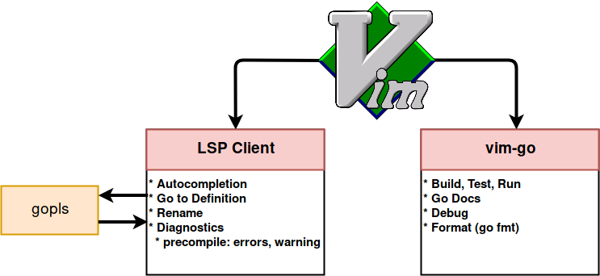
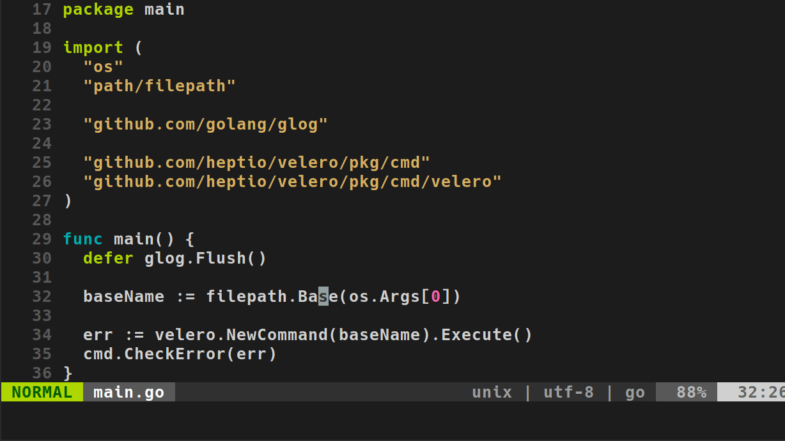
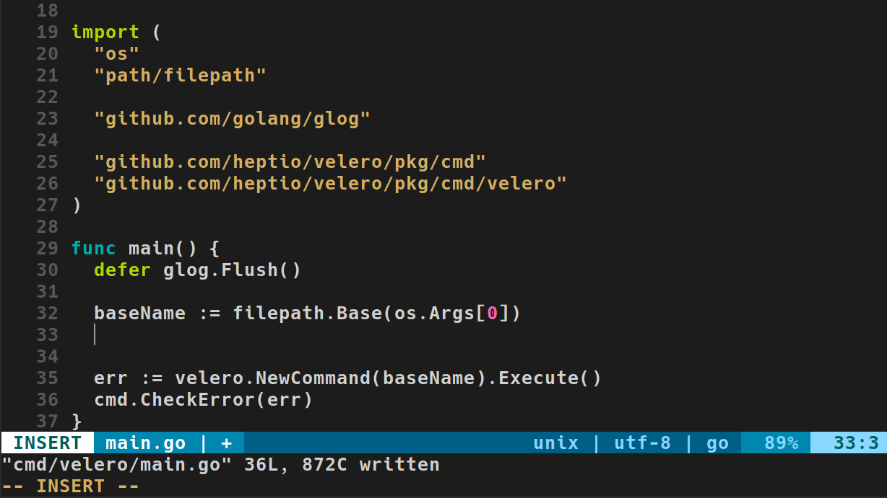

# VIM as a Go (Golang) IDE with LSP and vim-go

It is 2019 and there are many great ways to write Go. [Goland](https://www.jetbrains.com/go) is available for us familiar with the Intellij suite, [Visual Studio Code](https://code.visualstudio.com) (VSCode) has proven to be one of the most capable and enjoyable to use text editor/IDEs, and of course, Vim. I am no Vim-purist, I think if you are more productive in a different tool you should use it. But Vim remains a great multi-purpose tool in 2019+. Traditionally, writing Go in Vim meant adding the [vim-go](https://github.com/fatih/vim-go) plugin and coding away. Today, vim-go remains a great plugin, but with the introduction of the [Language Server Protocol](https://langserver.org) (LSP) means some of the vim-go concerns can be moved outside of it.

## The Past and The Present

Before LSPs, we _generally_ used [gocode](https://github.com/nsf/gocode), one of the many tools packaged in `vim-go`. I personally had a love-hate relationship with it, namely I found small changes in my environment could break it. Additionally, Go `1.10` changed the binary package architecture breaking `gocode`. Eventually the community moved to a [fork](https://github.com/mdempsky/gocode). Then, Go `1.11` introduced [Go modules](https://blog.golang.org/modules2019), so we moved to [another fork](https://github.com/stamblerre/gocode). I am super thankful for the awesomeness `gocode` brought us over the years. And I am very happy to see LSPs providing convergence for how editors/IDEs support programming languages.

Go's official LSP is [gopls](https://github.com/golang/go/wiki/gopls) pronounced "go please".

vim-go `1.20` (April 22, 2019) introduced `gopls` support. This made autocomplete use `gopls` by default. `:GoDef` and `GoInfo` can also be set to use `gopls` if you add the following configuration.

```
let g:go_def_mode='gopls'
let g:go_info_mode='gopls'
```

This means, triggering omnifunc `<C-r><C-o>`, will make a call out to `gopls`.

While this is great, my **preference** is to limit the concerns of `vim-go` to doing go-tool specific tasks such as `build`, `run`, `doc`, etc. Then, use a LSP client to handle autocompletion and traversing code (e.g. going to a definition). The breakdown of responsibilities would briefly look as follows.

<center></center>

The two best client options are [Conquer of Completion (coc.nvim)](https://github.com/neoclide/coc.nvim) and [LanguageClient-neovim](https://github.com/autozimu/LanguageClient-neovim). I recently switched to coc.nvim, and that is what this tutorial covers. However, LanguageClient-neovim is an excellent LSP client. Arguably more minimal (and written in rust!). `coc.nvim`'s benefit is that it has integration with some existing VSCode plugins. I like this a lot as I do not think the VSCode plugin market will slow down soon.

The following write-up and video details my Vim setup for Go in 2019 and why Vim is still my tool of choice.

## Prerequisites

In order to follow this setup, you'll need the following.

* [Neovim](https://github.com/neovim/neovim/wiki/Installing-Neovim) installed
  * I use Neovim instead of Vim, however, much of this tutorial can be done in Vim 8. Should you choose Vim, configuration file locations will vary.

* [vim-plug](https://github.com/junegunn/vim-plug) installed
  * Manages Vim plugins in simple and minimal manner.
 
* [yarn](https://yarnpkg.com/en/docs/install) installed
  * Required by the autocomplete tooling [coc.nvim](https://github.com/neoclide/coc.nvim), which we'll cover later.

* `$GOPATH/$GOBIN` set
  * See https://golang.org/cmd/go/#hdr-Environment_variables
  * These aren't entirely necessary, but I like them, and the examples will use them.
  * You may also want to append `$GOBIN` onto your `$PATH`.

* `~/.config/nvim/init.vim` created
  * This is the `.vimrc` of Neovim.

## Installing vim-go

1. Add the `vim-go` plugin to the list of plugins managed by vim-plug.

    ```
    call plug#begin('~/.vim/plugged')

    " < Other Plugins, if they exist >

    Plug 'fatih/vim-go'
    call plug#end()
    ```

1. Save and exit Vim.

1. Run `PlugInstall` via Vim.

    ```
    vim +PlugInstall
    ```

  output:

    ```
    Updated. Elapsed time: 0.011105 sec.
    [=]

    - Finishing ... Done!
    - vim-go: Installed
    ```

1. Run `GoInstallBinaries` via Vim.

    ```
    vim +GoInstallBinaries
    ```

1. Verify tools are in $GOBIN.

    ```
    ls -la $GOBIN
    ```

    output:
    ```
    asmfmt
    errcheck
    fillstruct
    gocode
    gocode-gomod
    godef
    gogetdoc
    goimports
    golangci-lint
    golint
    gometalinter
    gomodifytags
    gopls
    gorename
    gotags
    guru
    iferr
    impl
    keyify
    motion
    ```

  These binaries will be called by various commands in `vim-go`. Note that `gopls` was installed to. Your LSP will point to this binary.

1. Download a Go-based project.

    ```
    go get -d github.com/heptio/velero &&\
    ```

  * `-d`: Instruct `go` to not install the package.

1. Enter the project's directory.

    ```
    cd $GOPATH/src/github.com/heptio/velero
    ```

1. Vim into a Go file.

    ```
    vim cmd/velero/main.go
    ```

1. Try some of the following commands to verify `vim-go` is working.

  * `:GoDoc` (or shift+K) over a symbol to get the documention in a Vim buffer.
  * `:GoDef` go to definition (soon to be replaced by PLS client LSP client in next section.
  * `:GoDocBrowser` over a sypbol to open godoc.org.
  * `:GoBuild` to build the project.

<center></center>

## Installing coc.nvim

1. Update your plugin list in `~/.config/nvim/init.vim` to contain the following. 


    ```
    call plug#begin('~/.vim/plugged')

    " < Other Plugins, if they exist >

    Plug 'fatih/vim-go'
    Plug 'neoclide/coc.nvim', {'do': 'yarn install --frozen-lockfile'}
    call plug#end()
    ```
  
  If you do not have `yarn` installed, the above post step will fail and coc.nvim will not work.

1. Add the following default configuration to `~/.config/nvim/init.vim`.

    ```
    " -------------------------------------------------------------------------------------------------
    " coc.nvim default settings
    " -------------------------------------------------------------------------------------------------


    " if hidden is not set, TextEdit might fail.
    set hidden

    " Some servers have issues with backup files, see #649
    set nobackup
    set nowritebackup

    " Better display for messages
    set cmdheight=2

    " Smaller updatetime for CursorHold & CursorHoldI
    set updatetime=300

    " don't give |ins-completion-menu| messages.
    set shortmess+=c

    " always show signcolumns
    set signcolumn=yes

    " Use tab for trigger completion with characters ahead and navigate.
    " Use command ':verbose imap <tab>' to make sure tab is not mapped by other plugin.
    inoremap <silent><expr> <TAB>
          \ pumvisible() ? "\<C-n>" :
          \ <SID>check_back_space() ? "\<TAB>" :
          \ coc#refresh()
    inoremap <expr><S-TAB> pumvisible() ? "\<C-p>" : "\<C-h>"

    function! s:check_back_space() abort
      let col = col('.') - 1
      return !col || getline('.')[col - 1]  =~# '\s'
    endfunction

    " Use <c-space> to trigger completion.
    inoremap <silent><expr> <c-space> coc#refresh()

    " Use <cr> to confirm completion, `<C-g>u` means break undo chain at current position.
    " Coc only does snippet and additional edit on confirm.
    inoremap <expr> <cr> pumvisible() ? "\<C-y>" : "\<C-g>u\<CR>"

    " Use `[c` and `]c` to navigate diagnostics
    nmap <silent> [c <Plug>(coc-diagnostic-prev)
    nmap <silent> ]c <Plug>(coc-diagnostic-next)

    " Remap keys for gotos
    nmap <silent> gd <Plug>(coc-definition)
    nmap <silent> gy <Plug>(coc-type-definition)
    nmap <silent> gi <Plug>(coc-implementation)
    nmap <silent> gr <Plug>(coc-references)

    " Use U to show documentation in preview window
    nnoremap <silent> U :call <SID>show_documentation()<CR>

    function! s:show_documentation()
      if (index(['vim','help'], &filetype) >= 0)
        execute 'h '.expand('<cword>')
      else
        call CocAction('doHover')
      endif
    endfunction

    " Highlight symbol under cursor on CursorHold
    autocmd CursorHold * silent call CocActionAsync('highlight')

    " Remap for rename current word
    nmap <leader>rn <Plug>(coc-rename)

    " Remap for format selected region
    vmap <leader>f  <Plug>(coc-format-selected)
    nmap <leader>f  <Plug>(coc-format-selected)

    augroup mygroup
      autocmd!
      " Setup formatexpr specified filetype(s).
      autocmd FileType typescript,json setl formatexpr=CocAction('formatSelected')
      " Update signature help on jump placeholder
      autocmd User CocJumpPlaceholder call CocActionAsync('showSignatureHelp')
    augroup end

    " Remap for do codeAction of selected region, ex: `<leader>aap` for current paragraph
    vmap <leader>a  <Plug>(coc-codeaction-selected)
    nmap <leader>a  <Plug>(coc-codeaction-selected)

    " Remap for do codeAction of current line
    nmap <leader>ac  <Plug>(coc-codeaction)
    " Fix autofix problem of current line
    nmap <leader>qf  <Plug>(coc-fix-current)

    " Use `:Format` to format current buffer
    command! -nargs=0 Format :call CocAction('format')

    " Use `:Fold` to fold current buffer
    command! -nargs=? Fold :call     CocAction('fold', <f-args>)


    " Add diagnostic info for https://github.com/itchyny/lightline.vim
    let g:lightline = {
          \ 'active': {
          \   'left': [ [ 'mode', 'paste' ],
          \             [ 'cocstatus', 'readonly', 'filename', 'modified' ] ]
          \ },
          \ 'component_function': {
          \   'cocstatus': 'coc#status'
          \ },
          \ }


    " Using CocList
    " Show all diagnostics
    nnoremap <silent> <space>a  :<C-u>CocList diagnostics<cr>
    " Manage extensions
    nnoremap <silent> <space>e  :<C-u>CocList extensions<cr>
    " Show commands
    nnoremap <silent> <space>c  :<C-u>CocList commands<cr>
    " Find symbol of current document
    nnoremap <silent> <space>o  :<C-u>CocList outline<cr>
    " Search workspace symbols
    nnoremap <silent> <space>s  :<C-u>CocList -I symbols<cr>
    " Do default action for next item.
    nnoremap <silent> <space>j  :<C-u>CocNext<CR>
    " Do default action for previous item.
    nnoremap <silent> <space>k  :<C-u>CocPrev<CR>
    " Resume latest coc list
    nnoremap <silent> <space>p  :<C-u>CocListResume<CR>
    ```

  These provide some sensible key mappings and other settings. You can add or remove as you feel appropriate.

1. Tell `vim-go` to not take `gd` as its shortcut for go to definition.

		```
		" disable vim-go :GoDef short cut (gd)
		" this is handled by LanguageClient [LC]
		let g:go_def_mapping_enabled = 0
		```

	  This is disabled to allow `coc.vim` to do the `gd` resolution.

1. Save the file and exit Vim.

1. Install the `coc.nvim` plugin.

		```
		vim +PlugInstall
		```

1. Open Vim.

1. Verify `coc.nvim` is working by running CocInfo.

    ```
    :CocInfo
    ```

    output:
    ```
    ## versions

    vim version: NVIM v0.3.4
    node version: v11.14.0
    coc.nvim version: 0.0.65
    term: rxvt
    platform: linux

    ## Error messages

    ## Output channel: highlight
    ```

1. Edit the CocConfig.

    ```
    :CocConfig
    ```

		You may be prompted to install the JSON plugin. If you say yes, it'll validate JSON based on structure and schema. Pretty cool!

1. Setup the following [languageserver](https://github.com/neoclide/coc.nvim/wiki/Language-servers) to the configuration.

		```json
		{
			"languageserver": {
				"golang": {
					"command": "gopls",
					"rootPatterns": ["go.mod", ".vim/", ".git/", ".hg/"],
					"filetypes": ["go"]
				}
			}
		}
		```

		This assumes gopls is in your `$PATH`, if its not, point to it in your `$GOBIN`.

1. Restart Vim.

1. Open the project from before.

1. Verify `coc.nvim` is working by trying the following commands.

	* Type a package and `.`, autocomplete should pop up with suggestions from `[LS]` (Language Server).
	* Use `gd` to go to a definition.
  * Run `:CocList diagnostics` to see and search through all problems with the project.

<center></center>

## Play Around!

Now your environment is setup and it is just a matter of becoming more familiar with `vim-go` and `coc.nvim`.  Be sure to check the video at the top of this post for examples of my favorite tools and shortcuts. Also `vim-go` and `coc.nvim` have create documentation. It can be accessed in Vim with the following commands.

vim-go
```
:help vim-go
```

coc.nvim
```
:help coc.nvim
```
